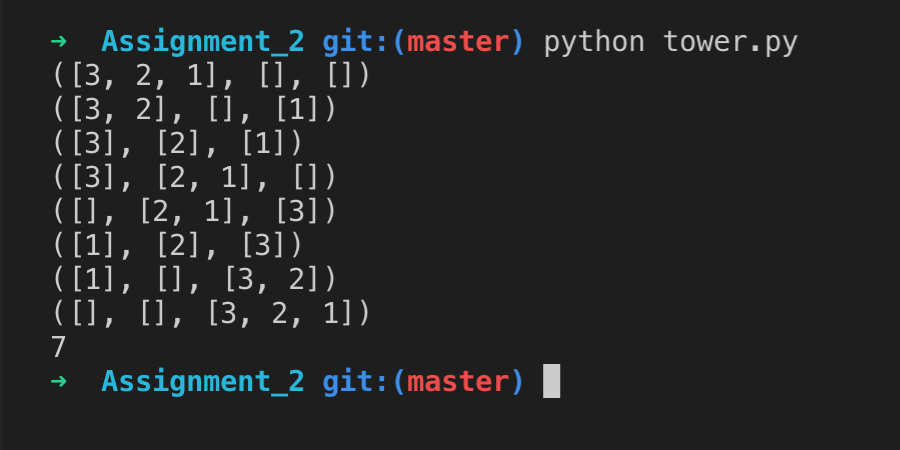

# TowerOfHanoi

Below is shown an image of the running game, it's displayed very simple. 3 boxes where 2 are empty and the first one
contains all disks. Afterwards 1 disc is moved at a time, where it's not allowed for a smaller to be placed below a greater.

Emil, Edmond and Florent
